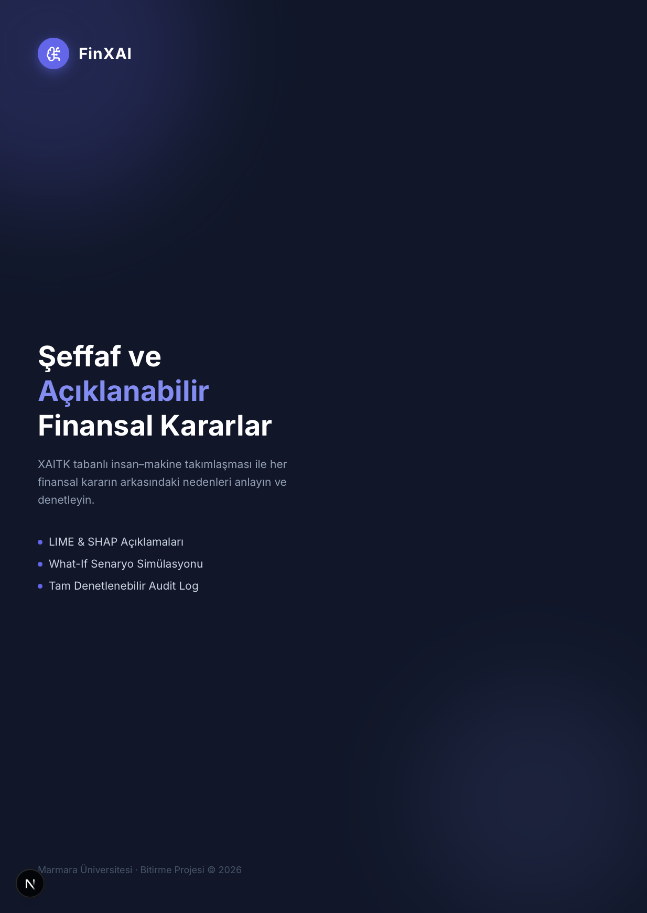
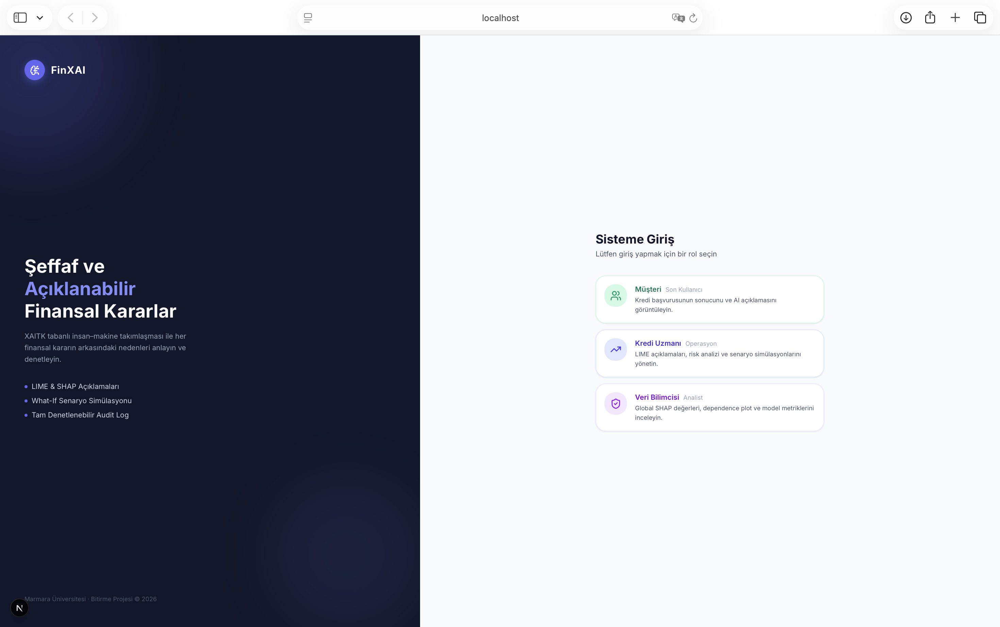
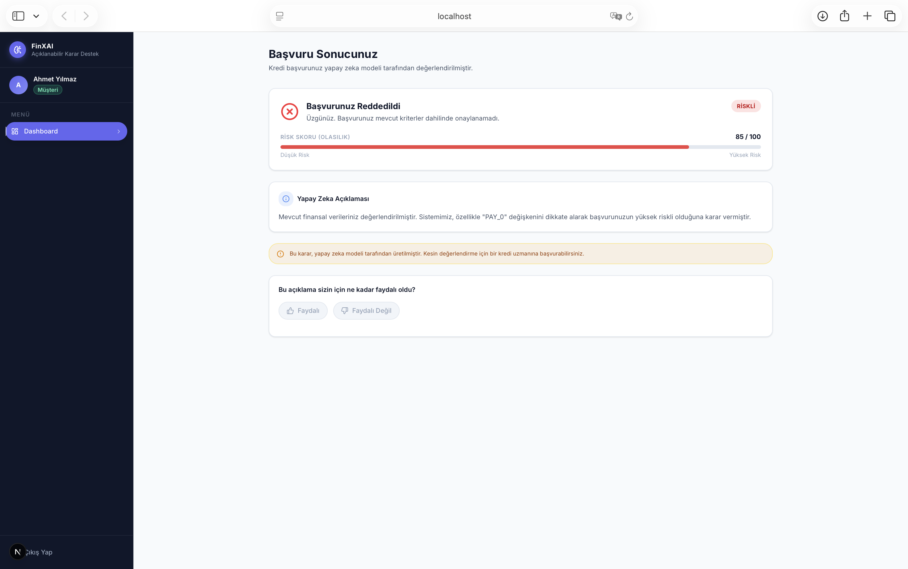
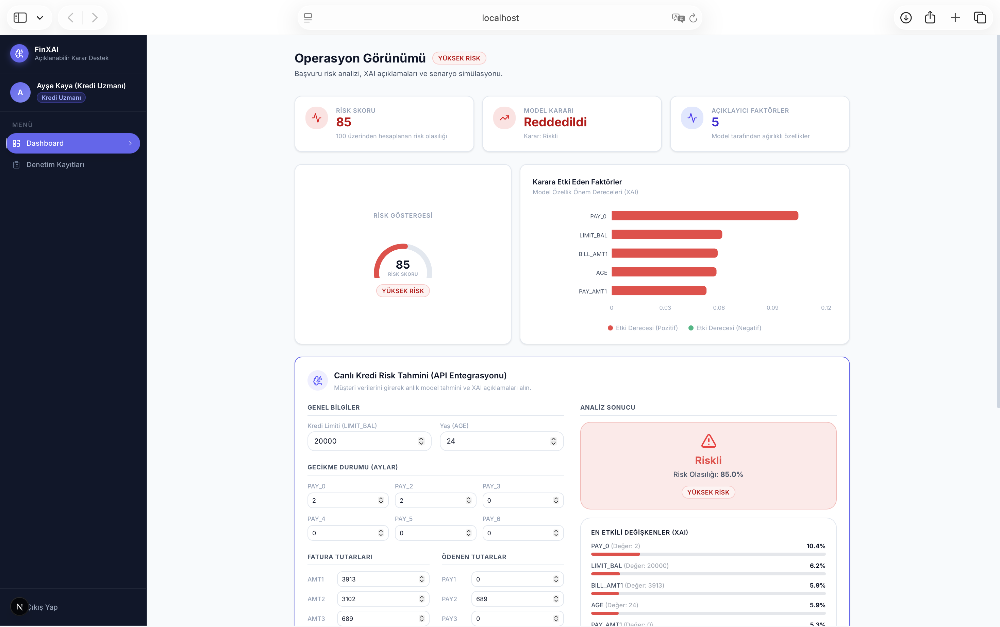
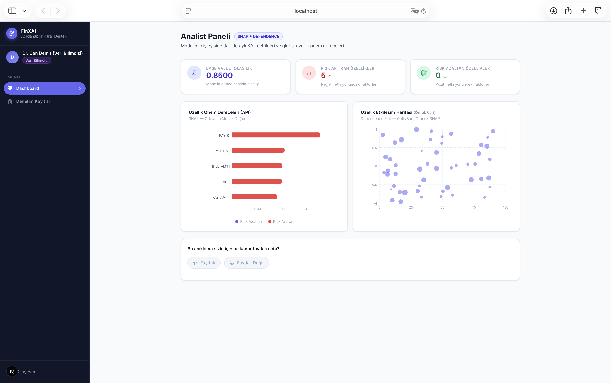

# FinXAI: Şeffaf ve Açıklanabilir Finansal Kararlar Platformu



## Proje Hakkında
**FinXAI**, Marmara Üniversitesi Bitirme Projesi kapsamında geliştirilmiş, XAITK (Açıklanabilir Yapay Zeka Araç Kiti) tabanlı insan-makine takımlaşmasını merkeze alan bir finansal karar destek sistemidir. Bu platform, kredi başvuru süreçlerindeki yapay zeka tabanlı kararların arkasındaki nedenleri şeffaf bir şekilde sunarak, her bir finansal kararın denetlenebilir ve anlaşılabilir olmasını sağlamayı amaçlamaktadır.

Proje, farklı kullanıcı rollerinin ihtiyaçlarına uygun olarak tasarlanmış arayüzler sunar:
- **Müşteri (Son Kullanıcı):** Kredi başvurularının sonuçlarını ve AI tarafından üretilen anlaşılır açıklamaları görüntüler.
- **Kredi Uzmanı (Operasyon):** LIME (Local Interpretable Model-Agnostic Explanations) açıklamalarını, risk analizlerini ve What-If (Durum) senaryo simülasyonlarını yönetir.
- **Veri Bilimcisi (Analist):** Global SHAP (SHapley Additive exPlanations) değerleri, dependence plot ve detaylı model performans metriklerini inceler.

## Temel Özellikler
- **Rol Tabanlı Erişim ve Paneller:** Müşteri, Uzman ve Analist için özelleştirilmiş, amaca yönelik arayüzler (Dashboards).
- **Açıklanabilir Yapay Zeka (XAI) Entegrasyonları:**
  - LIME ve SHAP grafikleri ile yerel (local) ve genel (global) model açıklamaları.
  - Makine öğrenmesi kararlarının insan diline yakınlaştırılması.
- **What-If Senaryo Simülasyonu:** Veriler üzerinde değişiklik yapılarak modelin kararlarının nasıl değişeceğini anında görebilme.
- **Tam Denetlenebilir Audit Log:** Sistemde yapılan her işlemin ve alınan her kararın güvenli bir şekilde kaydedilmesi ve raporlanabilmesi.
- **Modern ve Duyarlı Kullanıcı Arayüzü:** Next.js 16 ve Tailwind CSS v4 kullanılarak geliştirilen estetik, hızlı ve mobil uyumlu arayüz.

---

## Ekran Görüntüleri

### 1. Giriş Ekranı (Login)


### 2. Müşteri Paneli (Customer Dashboard)


### 3. Kredi Uzmanı Paneli (Specialist Dashboard & What-If Senaryosu)


### 4. Veri Bilimcisi Paneli (Analyst Dashboard & SHAP/LIME Metrikleri)


---

## Teknik Mimari ve Teknoloji Yığını

Proje, modern web teknolojileri temel alınarak geliştirilmiş ve modüler bir mimari kurgulanmıştır.

### Frontend (İstemci Tarafı)
- **Framework:** [Next.js (v16)](https://nextjs.org/) (App Router mimarisi)
- **Kütüphane:** [React (v19)](https://react.dev/)
- **Stil ve Tasarım:** [Tailwind CSS (v4)](https://tailwindcss.com/)
- **İkonlar:** [Lucide React](https://lucide.dev/)
- **Veri Görselleştirme:** [Recharts](https://recharts.org/) (Grafik ve XAI çizimleri için)
- **Durum Yönetimi (State Management):** [Zustand](https://zustand-demo.pmnd.rs/)
- **Veri Tabloları:** [TanStack React Table (v8)](https://tanstack.com/table/v8)

### Geliştirme ve Test Araçları
- **Dil:** TypeScript (Tip güvenliği için)
- **API Mocking (Sahte Veri ve İstekler):** [MSW (Mock Service Worker)](https://mswjs.io/) (Geliştirme aşamasında API bağımsızlığını sağlamak için)
- **Linting:** ESLint

### Klasör Yapısı (Folder Structure)
Projenin temel `src` klasör dizini şu şekildedir:

```text
src/
├── app/              # Next.js App Router sayfaları (Sayfa yönlendirmeleri, page.tsx, layout.tsx)
├── components/       # Genel ve tekrar kullanılabilir UI bileşenleri (Butonlar, Kartlar vb.)
├── features/         # Özelliğe (feature) dayalı modüller
│   ├── audit/        # Audit Log bileşenleri
│   ├── dashboard/    # Role özel paneller (Müşteri, Uzman, Analist)
│   ├── feedback/     # Geri bildirim modülü bileşenleri
│   └── what-if/      # Senaryo simülasyon modülü
├── hooks/            # Özel React Hook'ları (Custom Hooks)
├── lib/              # Genel yardımcı fonksiyonlar, formatlayıcılar (Utils)
├── mocks/            # MSW tabanlı API sahte (mock) istekleri ve handler'lar
├── services/         # API servis çağrıları ve veri katmanı
├── store/            # Zustand global durum (state) yöneticileri (Örn: useAuthStore)
└── types/            # TypeScript tip tanımlamaları (Interfaces, Types)
```

---

## Kurulum ve Çalıştırma

Projeyi yerel ortamınızda çalıştırmak için aşağıdaki adımları izleyebilirsiniz.

### 1. Gereksinimler
- **Node.js** (v20 veya üzeri önerilir)
- **npm**, **yarn** veya **pnpm** paket yöneticisi

### 2. Projeyi Klonlama
```bash
git clone https://github.com/aydnIbrahim/financial-xai-platform.git
cd financial-xai-platform
```

### 3. Bağımlılıkların Yüklenmesi
```bash
npm install
```

### 4. Geliştirme Sunucusunu Başlatma
MSW (Mock Service Worker) entegrasyonu public klasöründe başlatılmış olarak gelir (Service Worker aracılığıyla tarayıcıda API'leri mocklar). Geliştirme sunucusunu çalıştırmak için:

```bash
npm run dev
```

Uygulama başarıyla başlatıldığında tarayıcınızda [http://localhost:3000](http://localhost:3000) adresine giderek platformu görüntüleyebilirsiniz.

### 5. Build (Üretime Hazırlama)
Projenin üretim (production) versiyonunu derlemek için:
```bash
npm run build
npm run start
```

---

## Akademik Kapsam ve İnsan-Makine Takımlaşması (Human-AI Teaming)
Bu proje, XAI (Açıklanabilir Yapay Zeka) yöntemlerinin (özellikle LIME ve SHAP) gerçek dünya problemlerinde, bilhassa finansal kredi risk değerlendirmesinde nasıl kullanılabileceğini ortaya koyar.
Makine öğrenmesi algoritmalarının "kara kutu" (black-box) yapısını ortadan kaldırarak;
1. **Adalet (Fairness):** Veri bilimciler için bias (yanlılık) takibini kolaylaştırır.
2. **Hesap Verilebilirlik (Accountability):** Audit loglar ve kararların gerekçelendirilmesi ile yasal standartlara zemin hazırlar.
3. **Güven (Trust):** Son kullanıcıya kendi verileri ve alınan karar hakkında somut, şeffaf nedenler sunarak teknolojiye olan güveni artırır.

---

*Marmara Üniversitesi Bitirme Projesi Kapsamında Geliştirilmiştir.*
